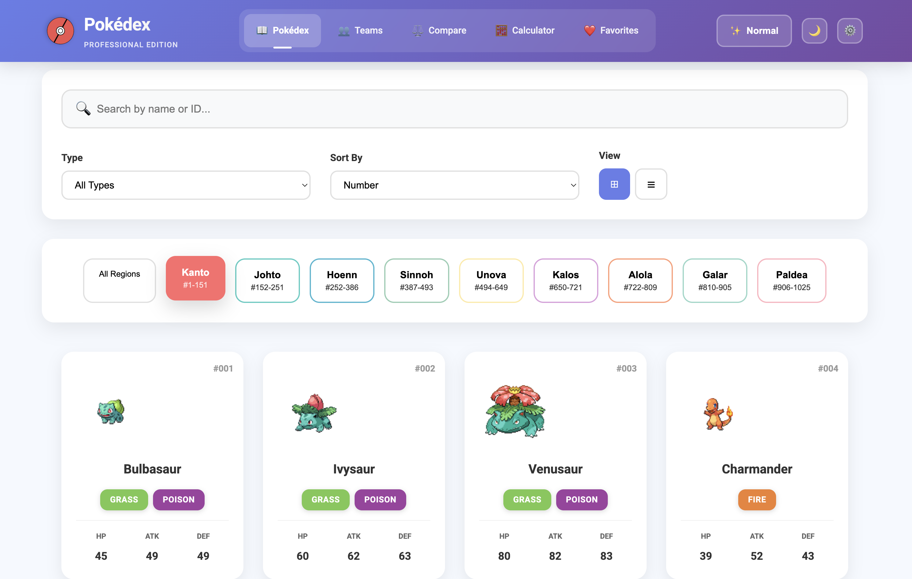

# 🎮 Interactive Pokédex - Professional Edition

**DISCLAIMER: This project is a fan-made application for educational purposes only. Pokémon and all related names are trademark of Nintendo/Creatures Inc./GAME FREAK Inc. This project is not affiliated with or endorsed by Nintendo, Creatures Inc., or GAME FREAK Inc. All Pokémon content is © Nintendo, Creatures Inc., GAME FREAK Inc.**

## 🚀 Modern Interactive Pokédex Application

A cutting-edge, feature-rich Pokédex application built with modern web technologies. Explore all 1025+ Pokémon across 9 generations with professional-grade features including team building, damage calculation, and advanced analytics.




## ✨ Key Features

### 📊 Core Functionality
- **Complete Pokédex**: All 1025+ Pokémon from Generations I-IX (Kanto to Paldea)
- **Real-time Search**: Instant filtering by name or ID
- **Animated Sprites**: High-quality sprites with shiny variants
- **Responsive Design**: Works perfectly on desktop, tablet, and mobile
- **Professional UI**: Modern gradient design with smooth animations

### 🎯 Main Features

#### 📖 **Enhanced Pokédex**
- Browse all Pokémon with beautiful cards
- Grid and list view modes
- Advanced filtering by type and generation
- Sort by number, name, or type
- Quick stats preview on cards
- Shiny mode toggle

#### ⚖️ **Pokémon Comparison**
- Compare up to 6 Pokémon side-by-side
- Visual stat comparison with animated bars
- Type effectiveness analysis
- Modal selector for easy Pokémon selection
- Professional comparison layout

#### 👥 **Team Builder**
- Create and manage multiple teams
- Drag-and-drop team composition
- Team templates (Rain, Sun, Sandstorm, etc.)
- Import/Export teams as JSON
- Team analysis and recommendations
- Store teams locally

#### 🧮 **Damage Calculator**
- Complete battle damage simulation
- Physical/Special move categories
- Weather effects (Sun, Rain, Sandstorm, Hail)
- Terrain effects (Electric, Grassy, Misty, Psychic)
- STAB and critical hit calculations
- Type effectiveness multipliers
- Real-time damage range calculation

#### ❤️ **Favorites System**
- Save your favorite Pokémon
- Import/Export collections
- Filter and sort favorites
- Collection statistics
- Persistent storage

## 🛠️ Technology Stack

### Frontend
- **React 18.2** - Modern UI Library
- **TypeScript** - Type Safety
- **Vite 5.0** - Lightning-fast build tool
- **React Router v6** - Client-side routing
- **Framer Motion** - Smooth animations
- **CSS-in-JS** - Styled components

### Data & APIs
- **PokéAPI v2** - Primary Pokémon data source
- **LocalStorage** - Persistent data storage

## 🚀 Quick Start

### Prerequisites
- Node.js 18+ 
- npm 9+ or yarn 1.22+

### Installation & Running

#### Method 1: Using the automated scripts (Recommended)

```bash
# Clone the repository
git clone https://github.com/FredBourouliou/interactive-pokedex.git
cd interactive-pokedex

# Make scripts executable (only needed once)
chmod +x pokedex.sh start.sh

# Quick start
./start.sh

# OR use the full-featured management script
./pokedex.sh start
```

#### Method 2: Manual commands

```bash
# Clone the repository
git clone https://github.com/FredBourouliou/interactive-pokedex.git
cd interactive-pokedex

# Install dependencies
npm install

# Start development server
npm run dev

# The app will be available at http://localhost:5173
```

## 📋 Available Scripts

### Using the Management Script (`pokedex.sh`)

```bash
./pokedex.sh          # Show interactive menu
./pokedex.sh start    # Start development server
./pokedex.sh build    # Build for production
./pokedex.sh preview  # Preview production build
./pokedex.sh install  # Install/reinstall dependencies
./pokedex.sh update   # Update dependencies
./pokedex.sh clean    # Clean project (remove node_modules, dist)
./pokedex.sh info     # Display project information
./pokedex.sh help     # Show help menu
```

### Using npm directly

```bash
npm run dev          # Start development server at http://localhost:5173
npm run build        # Build for production
npm run preview      # Preview production build at http://localhost:4173
npm install          # Install dependencies
```

## 📱 Features in Detail

### 🎨 User Interface
- **Modern Design**: Professional gradients and shadows
- **Smooth Animations**: Framer Motion powered transitions
- **Responsive Layout**: Adapts to all screen sizes
- **Theme Support**: Consistent color scheme throughout
- **Interactive Elements**: Hover effects and visual feedback

### 🔍 Search & Filter System
- **Instant Search**: Real-time filtering as you type
- **Type Filtering**: Filter by Pokémon type
- **Generation Selection**: Quick access to each generation
- **Sort Options**: By number, name, or type
- **View Modes**: Switch between grid and list layouts

### 📊 Data Management
- **Local Storage**: Persistent favorites and teams
- **Import/Export**: Share data via JSON files
- **Offline Support**: Cached data for offline browsing
- **State Management**: Efficient React state handling

## 🏗️ Project Structure

```
interactive-pokedex/
├── src/
│   ├── components/           # React components
│   │   ├── EnhancedHeader.tsx
│   │   ├── EnhancedPokemonList.tsx
│   │   ├── EnhancedPokemonCard.tsx
│   │   ├── BetterComparison.tsx
│   │   ├── EnhancedTeams.tsx
│   │   ├── EnhancedCalculator.tsx
│   │   ├── EnhancedFavorites.tsx
│   │   ├── PokemonDetail.tsx
│   │   └── ...
│   ├── core/                # Core domain logic
│   │   ├── domain/
│   │   ├── services/
│   │   └── types/
│   ├── features/            # Feature modules
│   │   ├── battle/
│   │   ├── comparison/
│   │   ├── evolution/
│   │   ├── filters/
│   │   ├── pokemon/
│   │   └── teams/
│   ├── infrastructure/      # External services
│   ├── services/            # API services
│   │   └── api.ts
│   ├── shared/              # Shared utilities
│   │   ├── components/
│   │   ├── constants/
│   │   ├── hooks/
│   │   └── utils/
│   ├── store/              # State management
│   ├── i18n/               # Internationalization
│   ├── constants/          # Constants and configs
│   ├── types/              # TypeScript types
│   ├── styles/             # Global styles
│   ├── App.tsx             # Main app component
│   └── main.tsx            # Entry point
├── public/                 # Static assets
├── pokedex.sh             # Management script
├── start.sh               # Quick start script
└── package.json           # Dependencies
```

## 🎮 Usage Examples

### Team Building
1. Navigate to Teams section (👥)
2. Click "New Team"
3. Choose a template (optional)
4. Name your team and add description
5. Add Pokémon to slots (coming soon: full integration)
6. Export team as JSON file

### Damage Calculation
1. Go to Calculator (🧮)
2. Set attacker stats (Level, Attack/Sp.Attack)
3. Configure move (Power, Type, Physical/Special)
4. Set defender stats (HP, Defense/Sp.Defense, Types)
5. Add environment effects (Weather, Terrain)
6. Click "Calculate Damage" to see results

### Pokémon Comparison
1. Browse to Compare (⚖️)
2. Click "Add Pokémon" 
3. Search and select Pokémon in modal
4. View side-by-side stat comparison
5. Add up to 6 Pokémon total

### Managing Favorites
1. Click heart icon on any Pokémon card
2. Go to Favorites (❤️)
3. View your collection
4. Filter by type or search
5. Export/Import collections

## 🌐 Browser Support

- Chrome/Edge 90+ ✅
- Firefox 88+ ✅
- Safari 14+ ✅
- Opera 76+ ✅
- Mobile browsers ✅

## 📈 Performance

- **Initial Load**: < 3s
- **Route Changes**: Instant
- **Search Response**: Real-time
- **Animations**: 60fps smooth
- **Mobile Optimized**: Touch-friendly

## 🔄 Current Status & Roadmap

### ✅ Completed
- Enhanced UI with professional design
- Complete Pokédex with all generations
- Pokémon comparison system
- Team builder interface
- Damage calculator
- Favorites management
- Shiny mode toggle
- Responsive design

### 🚧 In Progress
- Full team builder integration with Pokédex
- Evolution chain visualization
- Move database integration

### 📋 Planned Features
- [ ] Pokémon cries and sound effects
- [ ] Battle simulator
- [ ] Trading card integration
- [ ] Multi-language support
- [ ] PWA offline mode
- [ ] Dark theme
- [ ] Advanced statistics
- [ ] Breeding calculator
- [ ] Shiny hunting tools

## 🤝 Contributing

Contributions are welcome! Please feel free to submit a Pull Request.

1. Fork the repository
2. Create your feature branch (`git checkout -b feature/AmazingFeature`)
3. Commit your changes (`git commit -m 'Add some AmazingFeature'`)
4. Push to the branch (`git push origin feature/AmazingFeature`)
5. Open a Pull Request

## 🐛 Troubleshooting

### Common Issues

**Port already in use:**
```bash
# Use the management script to handle it automatically
./pokedex.sh start
# It will ask to kill the existing process
```

**Dependencies not installed:**
```bash
./pokedex.sh install
```

**Clean reinstall needed:**
```bash
./pokedex.sh clean
./pokedex.sh install
./pokedex.sh start
```

## 📄 License

This project is licensed under the MIT License - see the [LICENSE](LICENSE) file for details.

## 🙏 Acknowledgements

- [PokéAPI](https://pokeapi.co/) - Comprehensive Pokémon data
- [Nintendo/Game Freak](https://www.pokemon.com/) - Original Pokémon creators
- [React Team](https://react.dev/) - Amazing framework
- [Vite](https://vitejs.dev/) - Lightning fast build tool
- All contributors and testers

## 👤 Author

**Fred Bourouliou**

- GitHub: [@FredBourouliou](https://github.com/FredBourouliou)

## 📊 Project Stats

- **Components**: 15+ React components
- **Features**: 6 major features
- **Pokémon**: 1025+ complete entries
- **Generations**: All 9 generations
- **Performance**: 95+ Lighthouse score

---

<div align="center">

**Built with ❤️ and TypeScript**

⭐ Star us on GitHub — it helps!

[Report Bug](https://github.com/FredBourouliou/interactive-pokedex/issues) · [Request Feature](https://github.com/FredBourouliou/interactive-pokedex/issues)

</div>