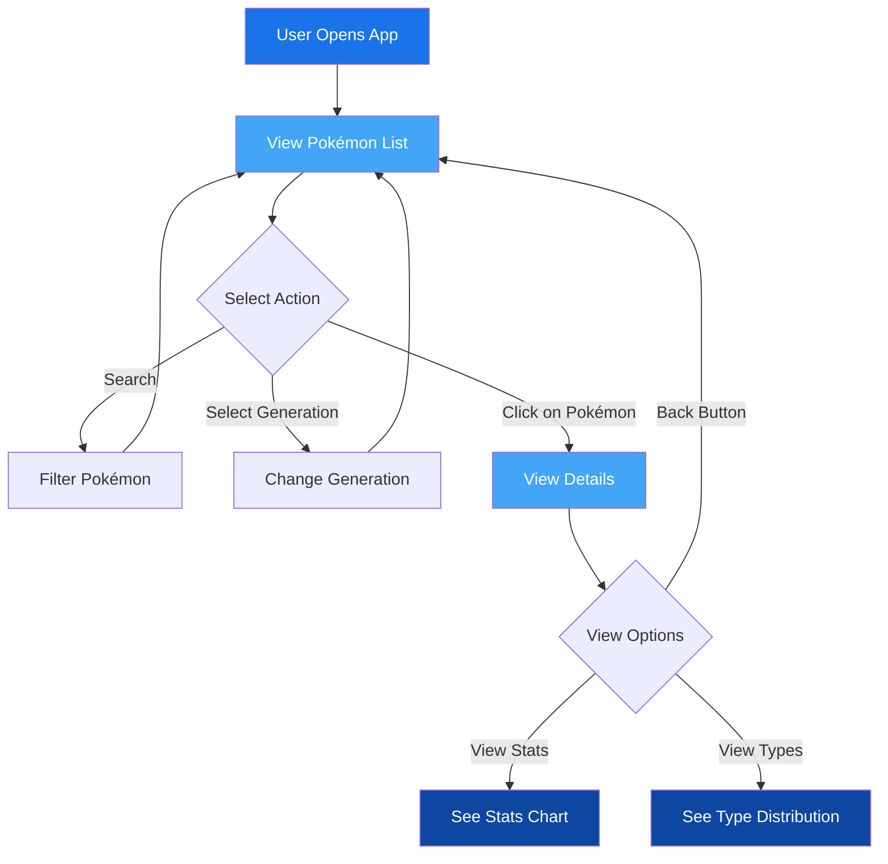

# Pokédex App

**DISCLAIMER: This project is a fan-made application for educational purposes only. Pokémon and all related names are trademark of Nintendo/Creatures Inc./GAME FREAK Inc. This project is not affiliated with or endorsed by Nintendo, Creatures Inc., or GAME FREAK Inc. All Pokémon content is © Nintendo, Creatures Inc., GAME FREAK Inc.**

# Interactive Pokédex - All Generations

An elegant, interactive web-based Pokédex application featuring all Pokémon generations with beautiful animations, visualizations, and detailed statistics.


## ✨ Features

- **Complete Pokédex**: Access to all Pokémon across 9 generations
- **Animated Sprites**: View animated GIFs of each Pokémon in action
- **Generation Selector**: Easily navigate between different Pokémon generations
- **Interactive UI**: Smooth animations and transitions powered by Framer Motion
- **Detailed Statistics**: Visualize Pokémon stats with interactive charts
- **Type Distribution**: Visual representation of Pokémon types
- **Responsive Design**: Works seamlessly on desktop and mobile devices
- **Instant Search**: Filter Pokémon by name or ID
- **Ocean Blue Theme**: Pleasing color scheme for extended viewing sessions

## 🔄 Application Flow



## 🛠️ Technologies Used

- **React**: Frontend UI library with TypeScript for type safety
- **Vite**: Lightning-fast build tool for modern web development
- **Framer Motion**: Advanced animation library for fluid UI transitions
- **Recharts**: Responsive charting library for statistics visualization
- **Axios**: Promise-based HTTP client for API requests
- **React Router**: Navigation and routing between different views
- **PokéAPI**: RESTful Pokémon data API providing comprehensive information

## 📊 Data Visualization

The application offers various visualizations:
- Bar charts for base statistics
- Pie charts for type distribution
- Color-coded type badges with corresponding Pokémon type colors
- Animated transitions between different views and states

## 📱 Responsive Design

The Pokédex is fully responsive:
- Grid layout adapts to different screen sizes
- Mobile-friendly navigation
- Touch-optimized interactions
- Accessible on tablets, phones, and desktops

## 🚀 Getting Started

### Prerequisites

- Node.js (v14.0.0 or higher)
- npm or yarn

### Installation

1. Clone the repository:
   ```bash
   git clone https://github.com/FredBourouliou/interactive-pokedex.git
   cd interactive-pokedex
   ```

2. Install dependencies:
   ```bash
   npm install
   ```

3. Start the development server:
   ```bash
   npm run dev
   ```

4. Open your browser and navigate to: 
   ```
   http://localhost:5173
   ```

## 🏗️ Project Structure

```
pokedex-app/
├── public/
│   └── pokeball.svg
├── src/
│   ├── components/
│   │   ├── GenerationSelector.tsx
│   │   ├── Header.tsx
│   │   ├── Loading.tsx
│   │   ├── PokemonCard.tsx
│   │   ├── PokemonDetail.tsx
│   │   ├── PokemonList.tsx
│   │   ├── SearchBar.tsx
│   │   └── StatsChart.tsx
│   ├── services/
│   │   └── pokemonService.ts
│   ├── App.tsx
│   ├── index.css
│   └── main.tsx
├── package.json
└── index.html
```

## 🔍 How It Works

1. **Data Fetching**: The application fetches Pokémon data from the PokéAPI
2. **Generational Organization**: Pokémon are organized by their respective generations
3. **Animated Sprites**: GIFs are loaded from multiple sources for maximum compatibility
4. **Stat Visualization**: Pokémon statistics are rendered as interactive charts
5. **Type Information**: Type data is displayed with corresponding colors and distributions
6. **Search Functionality**: Allows filtering across the current generation

## 📝 Future Enhancements

- Dark Mode support
- Team Builder functionality
- Evolution chain visualization
- Move list and compatibility
- Ability to compare multiple Pokémon
- Offline support with data caching
- User accounts to save favorite Pokémon

## 🤝 Contributing

Contributions are welcome! Please feel free to submit a Pull Request.

## 📄 License

This project is licensed under the MIT License - see the LICENSE file for details.

## 🙏 Acknowledgements

- [PokéAPI](https://pokeapi.co/) for the comprehensive Pokémon data
- [Pokémon Showdown](https://play.pokemonshowdown.com/) for additional sprite animations
- All Pokémon content and images are © Nintendo, Game Freak, and The Pokémon Company

## 👤 Author

**Frédéric Bourouliou**

- GitHub: [github.com/FredBourouliou](https://github.com/FredBourouliou)

---

<p align="center">Made with ❤️ and TypeScript</p> 